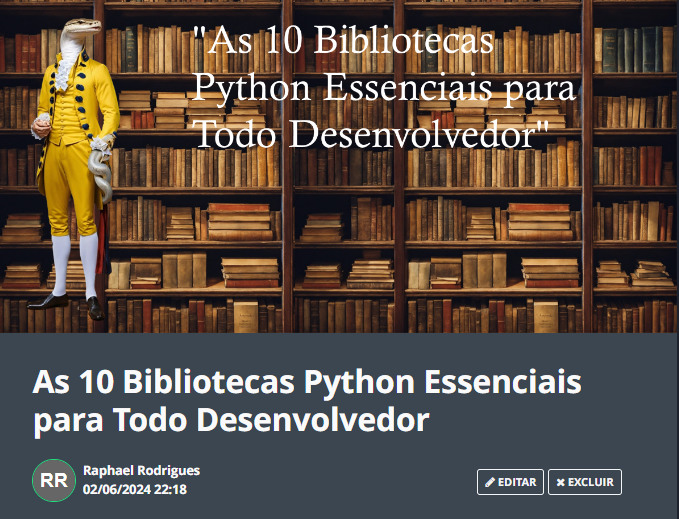

    

  
  

---

  

# Projeto de Artigo Técnico Gerado por I.A.s

 > ℹ️ **NOTA:** Este repositório foi desenvolvido como parte de um curso no qual atuei como instrutor técnico na plataforma [DIO](https://dio.me).

Este projeto tem como objetivo gerar um artigo técnico com um layout atrativo, leitura fluída e foco em aumentar sua autoridade técnica.

  <a href="https://web.dio.me/articles/as-10-bibliotecas-python-essenciais-para-todo-desenvolvedor?back=%2Farticles&page=1&order=oldest"> 📕Clique aqui para ler o artigo</a>

## 💻 Tecnologias Utilizadas

- [ChatGPT](https://chat.openai.com/) - para título e conteúdo
- [Lexica.art](https://lexica.art/) - para gerar imagens
- [PowerPoint](https://www.microsoft.com/en/microsoft-365/powerpoint) - para formatação de banners e layouts

## 📄 Prompts e Ferramentas

### ChatGPT：

|   Ação   | Prompt                                                                                                                                                                                                                                                                         |
| :------: | ------------------------------------------------------------------------------------------------------------------------------------------------------------------------------------------------------------------------------------------------------------------------------ |
|  Título  | As 10 Bibliotecas Python Essenciais para Todo Desenvolvedor                                                                                                                                                                                                    |
| Conteúdo | Crie um artigo com o tema As 10 Bibliotecas Python Essenciais para Todo Desenvolvedor. Faça um call to action para minhas redes sociais. Dê forma a biblioteca no código. Explique para o que serve cada biblioteca. Cada bloco deve ter a solução da biblioteca de forma chamativa {Regras}. No máximo 5 linhas por blocos de explicação de cada biblioteca. Explique as bibliotecas de maneira informal para leigos. |

### Lexica.art：

- Utilizamos imagens do acervo público geradas por outras pessoas. Durante a gravação do conteúdo, os termos de pesquisa utilizados foram:
  - Python

## ✨ Funcionalidades

- Conteúdo gerado via ChatGPT
- Utilização de imagens do acervo público via Lexica.art

## 📚 Materiais

- Prompts utilizados

## 🛠️ Instruções de Execução

Utilize os prompts acima nas ferramentas sugeridas para gerar o material base. Em seguida, utilize uma ferramenta de edição de documentos como PowerPoint, LibreOffice ou InDesign para a diagramação. O passo a passo em vídeo pode ser conferido na plataforma da [DIO](https://dio.me).

## 👨‍💻 Especialista

    
    />
    
&nbsp;&nbsp;&nbsp;Raphael Rodrigues 
    &nbsp;&nbsp;&nbsp;
    <a href="https://github.com/phrafinhas">
    GitHub</a>&nbsp;|&nbsp;
    <a href="https://www.linkedin.com/in/raphael-rodrigues-545a79245/">
    LinkedIn</a>
    &nbsp;|&nbsp;

---

⌨️ com 💜 por [Raphael Rodrigues](https://github.com/phrafinhas)
